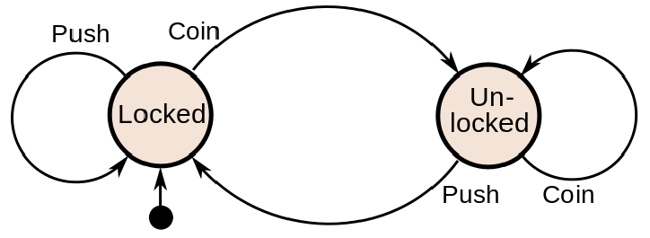
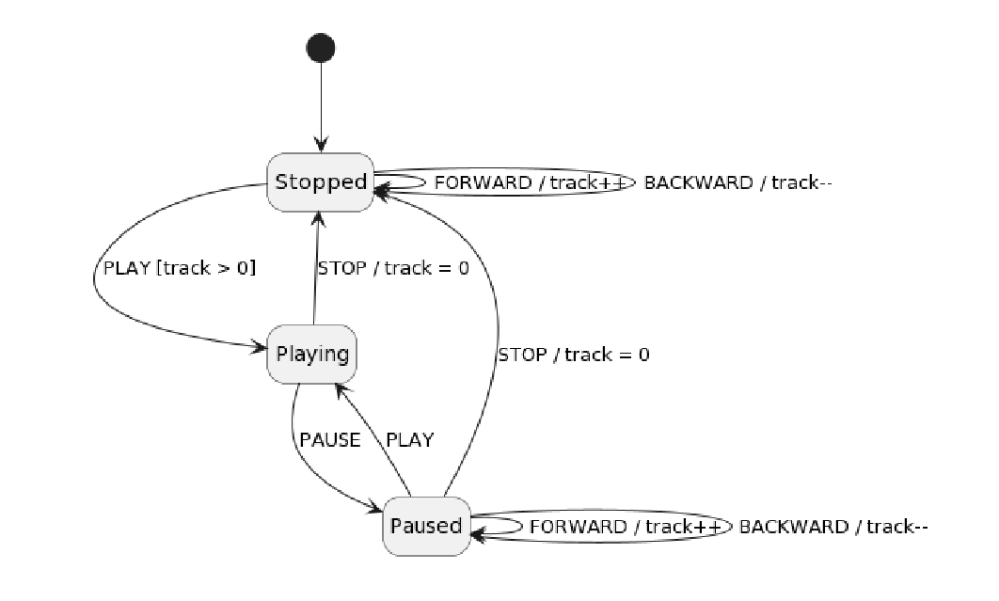

# Rust State Machine

This project is part of an assignment in Model Driven Development which is a coarce for my Software Engineering Master degree. 


## Turnstyle Example

Here is a simple example for the classical turnstyle state machine. It has two states, `Locked` and `Un-locked`. As well as two events, `Push`and `Coin`.

Inserting a coin will change the state from locked to Unlocked, where it would then be possible to walk push the turnstyle over. This will in return change the state to locked. See the diagram below 



The same example can be implemented using the StateMachineBuilder. The first two arguments are for the internal store and the initial state for the state machine. Use the `.state` function to add a new state and use `.event(event, Target)` for creating an event that changes the internal state when triggered. Build will check for a valid state_machine and either return the StateMachine or an error. 
``` Rust
fn main() {
    let mut turnstyle = StateMachineBuilder::new((), "Locked")
        .state("Locked")
            .event("Coin", "Unlocked")
        .state("Unlocked")
            .event("Push", "Locked")
        .build().unwrap();

    turnstyle.trigger("Coin");
    println!("State: {}", turnstyle.state);

    turnstyle.trigger("Push");
    println!("State: {}", turnstyle.state);
}
```
This program will then print out the following
```yaml
State: UnLocked
State: Locked
```


If you would like compile time type safety for your states and events, then you can use an enum instead. Below is a more turse example of using an enum for the state and event. The output is the same as above.

``` Rust
#[derive(Debug, Clone, Copy, PartialEq)]
enum State {
    Locked,
    UnLocked
}

#[derive(PartialEq)]
enum Event {
    Coin,
    Push,
}

fn main() {

    use State::{Locked, UnLocked};
    use Event::{Coin, Push};
    
    let mut turnstyle = StateMachineBuilder::new((), Locked)
        .state(Locked)
            .event(Coin, UnLocked)
        .state(UnLocked)
            .event(Push, Locked)
        .build().unwrap();

    turnstyle.trigger(Coin);
    println!("State: {:?}", turnstyle.state);

    turnstyle.trigger(Push);
    println!("State: {:?}", turnstyle.state);
}
```

You can actually use any type for the event as long as it implements the `PartialEqual` trait. The same is true for the state as long as it implements the `Clone` and `Copy` trait. This allows for a very generic and extentible implementation where the user of the StateMachine can decide their own preffered style. 

## Cd-Player Example

This next example will showcase some more complex functionalities. Here we have three states `Stopped`, `Playing` and `Paused`, with five events being. `Stop`, `Play`, `Pause`, `Forward` and `Backward`. The cd-player will start in the stopped state. To start you must first forward the tape using the forward event. When a track has been chosen you can start playing music with the play event. See the full diagram for a full understanding. 



For this example the initial value of the track is set to 0 and the initial state is set to stopped. A condition is set on the Play event for the stopped state which which will only change the state to playing if the track is above 0. The Forward and Backward event will add or subtract 1 from the track state 

```Rust 
fn main() {

    // Create store for state machine. In this case it is an integer
    let track = 0;
    
    let mut cd_player = StateMachineBuilder::new(track, "Stopped")
    .state("Stopped")
        .event("Play", "Playing").condition(|track| *track > 0 )
        .event("Forward", "Stopped").before_condition(|track| *track += 1 )
        .event("Backward", "Stopped").before_condition(|track| *track -= 1)
    .state("Playing")
        .event("Stop", "Stopped").after_condition(|track| *track = 0)
        .event("Pause", "Paused")
    .state("Paused")
        .event("Play", "Playing")
        .event("Stop", "Stopped").after_condition(|track| *track = 0)
        .event("Forward", "Paused").before_condition(|track| *track += 1)
        .event("Backward", "Paused").before_condition(|track| *track -= 1)
    .build()
    .unwrap();

    println!("Track: {}, State: {}", cd_player.store, cd_player.state);

    cd_player.trigger("Forward");
    println!("Track: {}, State: {}", cd_player.store, cd_player.state);

    cd_player.trigger("Play");
    println!("Track: {}, State: {}", cd_player.store, cd_player.state);
}
```


## Internal DSL idealogy

## Implementation

### State Machine 

### State Machine builder


